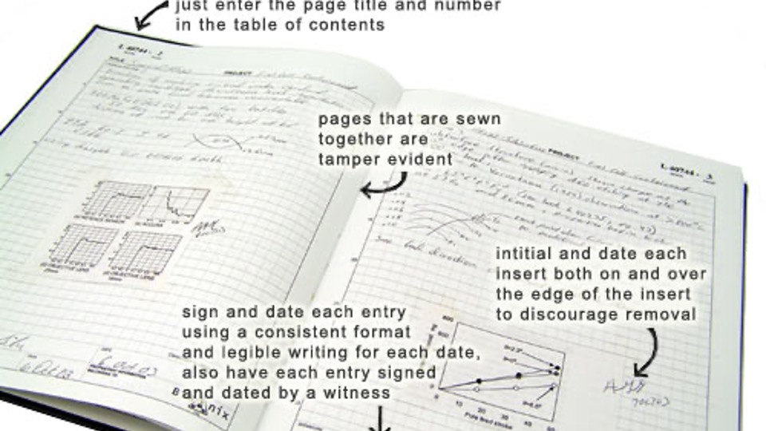

## Ethical on Data

::: {.r-fit-text}
“Fabrication 
and 
Falsification"
:::

It is a primary responsibility of a researcher to avoid either a false statement or an omission that distorts the research record. 

A researcher must not report anticipated research results that had not yet been observed at the time of submission of the report.

## Avoid misconduct on data

- Data integrity
- Use and mis-use of data
- Ownership and access of data
- Storage and Retention of Data
- Data privacy

## Data integrity

maintain a **clear and complete record of data** acquired. 
sufficient detail to permit examination for the purpose of replicating the research, responding to questions that may result from unintentional error or misinterpretation, establishing authenticity of the records, and confirming the validity of the conclusions.
destruction of research records or the failure to maintain and produce research records ^[http://www.provost.pitt.edu/documents/GUIDELINES%20FOR%20ETHICAL%20PRACTICES%20IN%20RESEARCH-FINALrevised2-March%202011.pdf
]

## Data integrity: standard practice Data recording

- Record data in ink in an proper notebook
- Proper notebook
  - indexed
  - consecutively numbered pages
  - permanently bound
- Entries should not be erased 
  - use a thin line cross
  - initialed dated correction written separately
  - an explanatory note, near the original entry or in the margin
  
## Data integrity

- All pages of a notebook should be dated and initialed. 
- printouts from instruments or computers, 
  - labeled and pasted into the notebook or, 
  - stored securely and referenced in the notebook as to storage location. 

## example notebook

{fig-align="center"}

## Use and Mis-use I

- Negative result data
- Large background
Do not: withholding of information about confounding factors. If some data should be disregarded for a stated reason, confirmed by an approved statistical test for neglecting outliers, the reason should be stated in the published accounts. 

Any intentional or reckless disregard for the truth in reporting observations may be considered to be an act of research misconduct. 

## Use and Mis-use II

The use of photo-images not to misrepresent the underlying data.

**Do not**

- add or delete any part of the image: a band
- differentially adjust the intensity
- label an image from one experiment as representing a different experiment
- splice image without using a line indicating the deletion, or to juxtapose pieces from different image onto a single image.

## Data cleansing

:::: {.columns}

::: {.column width="50%"}

**Dirty data**
- Invalid	
- Inaccurate	
- Incomplete	
- Inconsistent	
- Duplicate entries	
- Incorrectly formatted	

:::

::: {.column width="50%"}

**Clean data**
- Valid
- Accurate
- Complete
- Consistent
- Unique
- Uniform

:::

::::

## Example: Data validation

A date of birth as dd-mm-yyyy,

day field will allow numbers up to 31

month field up to 12

year field up to 2021

## Example: Inaccurate data

Survey question:

How often do you go grocery?

- Every day
- Once a week
- Biweekly
- Once a month
- Less than once a month
- Never

Inaccurate number from instruments

## Example: Incomplete data

Missing data

Handling:
- Prevent
- Listwise or case deletion, Pairwise deletion
- Imputation: Mean substitution, Regression imputation, Maximum likelihood, Expectation-Maximization
- Sensitivity analysis
- Last observation carried forward

## Example: Inconsistent data

In your survey about demographic variables, including age, ethnicity, education level, and socioeconomic status.

One participant enters 
“13” for their age
PhD-level education as their highest attained degree

Or

“14” for their age
Have 2 children

## Example: Duplicate entries

Fills out the questionnaire twice
Record twice or multiple time
Subject duplication

## Example: Nonuniform data

In a survey, ask to enter their gross salary in U.S. dollars.
Some respond with their monthly salary
others report their annual salary
Using difference units

## Ownership and access of data

Research data obtained in studies performed at the University and/or by employees of the University are not the property of the researcher who generated or observed them or even of the principal investigator of the research group. They belong to the University, which can be held accountable for the integrity of the data even if the researchers have left the University.

## Storage and Retention of Data

- Stored securely for at least five years after completion
- Deposited in a national or international databank
  - X-ray crystallographic data on protein structures, 
  - human genomic
  - proteomic data
  - DNA microarray data.

## Data privacy

**By Law**

- National Health Act: 2007
- Personal data protection act: 2019

## Data protection

- anonymization
- access control
- avoid share drive

## References

-   https://sparkbyexamples.com/r-programming/select-rows-in-r/
-   https://4va.github.io/biodatasci/
-   https://bioconnector.github.io/
